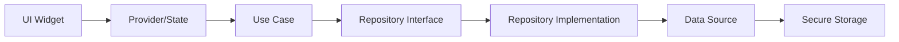

# Documento de Diseño: Markey Password Manager

## Resumen General

Markey es una aplicación móvil de gestión de contraseñas desarrollada en Flutter que proporciona almacenamiento seguro local mediante cifrado AES-256. La arquitectura sigue el patrón Clean Architecture con separación clara entre capas de presentación, dominio y datos. La aplicación utiliza bibliotecas modernas de Flutter para crear una interfaz visualmente atractiva con animaciones fluidas, efectos glassmorphism y transiciones suaves.

### Tecnologías Principales

**Framework y Lenguaje:**
- Flutter 3.x
- Dart 3.x

**Seguridad y Almacenamiento:**
- `flutter_secure_storage` - Almacenamiento cifrado de claves
- `encrypt` - Cifrado AES-256-GCM
- `local_auth` - Autenticación biométrica
- `crypto` - Funciones hash y derivación de claves

**Funcionalidad:**
- `otp` - Generación de códigos TOTP
- `password_strength` - Validación de fortaleza de contraseñas
- `qr_code_scanner` - Escaneo de códigos QR para TOTP
- `share_plus` - Compartir enlaces seguros
- `path_provider` - Acceso a directorios del sistema

**UI y Animaciones:**
- `flutter_animate` - Animaciones declarativas
- `google_fonts` - Tipografía profesional
- `flutter_slidable` - Acciones deslizables
- `shimmer` - Efectos de carga
- `flutter_staggered_animations` - Animaciones escalonadas
- `glassmorphism` / `flutter_glassmorphism` - Efectos de vidrio
- `flutter_svg` - Iconos vectoriales
- `lottie` - Animaciones complejas

**Gestión de Estado:**
- `provider` o `riverpod` - Gestión de estado reactiva

## Arquitectura

### Patrón Clean Architecture

La aplicación sigue Clean Architecture con tres capas principales:

```
lib/
├── core/                    # Utilidades compartidas
│   ├── constants/
│   ├── errors/
│   ├── theme/
│   └── utils/
├── features/                # Características por dominio
│   ├── auth/
│   │   ├── data/           # Fuentes de datos, modelos
│   │   ├── domain/         # Entidades, casos de uso
│   │   └── presentation/   # UI, widgets, providers
│   ├── vault/              # Gestión de entradas
│   ├── generator/          # Generador de contraseñas
│   ├── security/           # Análisis de seguridad
│   ├── totp/               # Códigos 2FA
│   ├── backup/             # Respaldo y restauración
│   └── settings/           # Configuración
└── main.dart
```

### Capas de la Arquitectura

**1. Capa de Presentación (Presentation Layer)**
- Widgets de Flutter
- Gestión de estado con Provider/Riverpod
- Lógica de UI y navegación
- Animaciones y efectos visuales

**2. Capa de Dominio (Domain Layer)**
- Entidades de negocio
- Casos de uso (Use Cases)
- Interfaces de repositorios
- Lógica de negocio pura

**3. Capa de Datos (Data Layer)**
- Implementación de repositorios
- Fuentes de datos locales
- Modelos de datos
- Servicios de cifrado

### Flujo de Datos



## Componentes e Interfaces

### 1. Sistema de Autenticación

**AuthService**
```dart
abstract class AuthService {
  Future<bool> setupMasterPassword(String password);
  Future<bool> setupMasterPin(String pin);
  Future<bool> authenticateWithPassword(String password);
  Future<bool> authenticateWithPin(String pin);
  Future<bool> authenticateWithBiometrics();
  Future<bool> isBiometricsAvailable();
  Future<void> enableBiometrics();
  Future<void> disableBiometrics();
  Future<bool> isAuthenticated();
  Future<void> logout();
}
```

**Implementación:**
- Deriva clave maestra usando PBKDF2 con 100,000 iteraciones
- Almacena hash de contraseña/PIN usando Argon2 o bcrypt
- Integra con `local_auth` para biometría
- Mantiene estado de sesión en memoria

### 2. Sistema de Cifrado

**EncryptionService**
```dart
abstract class EncryptionService {
  Future<String> encrypt(String plaintext, String masterKey);
  Future<String> decrypt(String ciphertext, String masterKey);
  Future<Uint8List> encryptBytes(Uint8List data, String masterKey);
  Future<Uint8List> decryptBytes(Uint8List data, String masterKey);
  String deriveMasterKey(String password, String salt);
  String generateSalt();
}
```

**Implementación:**
- Usa AES-256-GCM para cifrado autenticado
- Genera IV aleatorio para cada operación
- Deriva claves con PBKDF2 (100,000 iteraciones)
- Formato: `salt:iv:ciphertext:tag`

### 3. Repositorio de Entradas (Vault)

**VaultRepository**
```dart
abstract class VaultRepository {
  Future<List<Entry>> getAllEntries();
  Future<Entry> getEntryById(String id);
  Future<void> createEntry(Entry entry);
  Future<void> updateEntry(Entry entry);
  Future<void> deleteEntry(String id);
  Future<List<Entry>> searchEntries(String query);
  Future<List<Entry>> getEntriesByCategory(String category);
  Future<List<Entry>> getFavorites();
  Future<void> toggleFavorite(String id);
}
```

**Entry Entity**
```dart
class Entry {
  final String id;
  final String title;
  final String username;
  final String password;
  final String? url;
  final String? notes;
  final List<String> categories;
  final bool isFavorite;
  final String? totpSecret;
  final List<PasswordHistory> passwordHistory;
  final DateTime createdAt;
  final DateTime updatedAt;
}
```

### 4. Generador de Contraseñas

**PasswordGeneratorService**
```dart
abstract class PasswordGeneratorService {
  String generate(PasswordGeneratorConfig config);
  PasswordStrength evaluateStrength(String password);
}

class PasswordGeneratorConfig {
  final int length;
  final bool includeUppercase;
  final bool includeLowercase;
  final bool includeNumbers;
  final bool includeSymbols;
  final String? excludeCharacters;
}

enum PasswordStrength { weak, medium, strong, veryStrong }
```

**Implementación:**
- Usa `Random.secure()` para generación criptográficamente segura
- Valida que al menos un tipo de carácter esté seleccionado
- Garantiza que la contraseña contenga al menos un carácter de cada tipo seleccionado
- Evalúa fortaleza usando entropía y patrones comunes

### 5. Generador TOTP

**TotpService**
```dart
abstract class TotpService {
  String generateCode(String secret);
  int getRemainingSeconds();
  bool validateSecret(String secret);
  String parseSecretFromQR(String qrData);
}
```

**Implementación:**
- Usa algoritmo HMAC-SHA1 estándar
- Genera códigos de 6 dígitos
- Período de 30 segundos
- Decodifica secretos Base32

### 6. Analizador de Seguridad

**SecurityAnalyzerService**
```dart
abstract class SecurityAnalyzerService {
  Future<SecurityReport> analyzeVault(List<Entry> entries);
  PasswordStrength analyzePassword(String password);
  Future<bool> isPasswordCompromised(String password);
}

class SecurityReport {
  final int totalPasswords;
  final int weakPasswords;
  final int duplicatePasswords;
  final int compromisedPasswords;
  final double overallScore;
  final List<SecurityIssue> issues;
}
```

**Implementación:**
- Calcula entropía de contraseñas
- Detecta duplicados con hash comparison
- Verifica contra API de Have I Been Pwned usando k-anonymity
- Genera puntuación de 0-100

### 7. Sistema de Respaldo

**BackupService**
```dart
abstract class BackupService {
  Future<String> createBackup(String masterPassword);
  Future<void> exportBackup(String backupData, String path);
  Future<String> importBackup(String path);
  Future<void> restoreBackup(String backupData, String masterPassword);
}
```

**Formato de Respaldo:**
```json
{
  "version": "1.0",
  "timestamp": "2024-01-01T00:00:00Z",
  "salt": "...",
  "data": "encrypted_json_string"
}
```

### 8. Gestor de Portapapeles

**ClipboardService**
```dart
abstract class ClipboardService {
  Future<void> copyWithAutoClear(String text, Duration clearAfter);
  Future<void> clearClipboard();
  void cancelScheduledClear();
}
```

**Implementación:**
- Usa `Clipboard.setData()` de Flutter
- Programa limpieza con `Timer`
- Cancela timers anteriores al copiar nuevo contenido

### 9. Sistema de Bloqueo Automático

**AutoLockService**
```dart
abstract class AutoLockService {
  void startMonitoring();
  void stopMonitoring();
  void resetTimer();
  void setLockDuration(Duration duration);
  Stream<bool> get lockStateStream;
}
```

**Implementación:**
- Usa `WidgetsBindingObserver` para detectar cambios de estado de app
- Mantiene timer que se reinicia con interacciones
- Emite eventos cuando la app debe bloquearse

### 10. Gestor de Temas

**ThemeService**
```dart
abstract class ThemeService {
  ThemeMode getCurrentTheme();
  Future<void> setTheme(ThemeMode mode);
  ThemeData getLightTheme();
  ThemeData getDarkTheme();
}
```

**Implementación:**
- Define paletas de colores para modo claro y oscuro
- Usa `google_fonts` para tipografía consistente
- Aplica efectos glassmorphism en componentes clave
- Persiste preferencia en almacenamiento local

## Modelos de Datos

### Entry Model (Almacenamiento)

```dart
class EntryModel {
  final String id;
  final String encryptedData; // JSON cifrado con todos los campos
  final DateTime createdAt;
  final DateTime updatedAt;
  
  Map<String, dynamic> toJson();
  factory EntryModel.fromJson(Map<String, dynamic> json);
}
```

**Estructura de datos cifrados:**
```json
{
  "title": "Gmail",
  "username": "user@example.com",
  "password": "SecurePass123!",
  "url": "https://gmail.com",
  "notes": "Cuenta personal",
  "categories": ["Personal", "Correo"],
  "isFavorite": true,
  "totpSecret": "JBSWY3DPEHPK3PXP",
  "passwordHistory": [
    {
      "password": "OldPass456!",
      "changedAt": "2024-01-01T00:00:00Z"
    }
  ]
}
```

### Category Model

```dart
class Category {
  final String id;
  final String name;
  final String colorHex;
  final bool isPredefined;
  
  static List<Category> getPredefinedCategories() {
    return [
      Category(id: '1', name: 'Trabajo', colorHex: '#2196F3', isPredefined: true),
      Category(id: '2', name: 'Personal', colorHex: '#4CAF50', isPredefined: true),
      Category(id: '3', name: 'Bancario', colorHex: '#FF9800', isPredefined: true),
      Category(id: '4', name: 'Redes Sociales', colorHex: '#9C27B0', isPredefined: true),
      Category(id: '5', name: 'Compras', colorHex: '#F44336', isPredefined: true),
      Category(id: '6', name: 'Correo', colorHex: '#00BCD4', isPredefined: true),
    ];
  }
}
```

### Settings Model

```dart
class AppSettings {
  final Duration autoLockDuration;
  final Duration clipboardClearDuration;
  final bool biometricsEnabled;
  final ThemeMode themeMode;
  final bool breachCheckEnabled;
  
  Map<String, dynamic> toJson();
  factory AppSettings.fromJson(Map<String, dynamic> json);
  
  static AppSettings getDefaults() {
    return AppSettings(
      autoLockDuration: Duration(minutes: 2),
      clipboardClearDuration: Duration(seconds: 30),
      biometricsEnabled: false,
      themeMode: ThemeMode.system,
      breachCheckEnabled: true,
    );
  }
}
```

### Almacenamiento Local

**Estructura de flutter_secure_storage:**
```
Keys:
- "master_password_hash" -> Hash de contraseña maestra
- "master_pin_hash" -> Hash de PIN maestro
- "encryption_salt" -> Salt para derivación de clave
- "biometrics_enabled" -> "true" o "false"
- "entries" -> JSON array cifrado de todas las entradas
- "categories" -> JSON array de categorías personalizadas
- "settings" -> JSON cifrado de configuración
```

## Diseño de UI

### Pantallas Principales

**1. Pantalla de Autenticación**
- Campo de contraseña/PIN con animación de entrada
- Botón de autenticación biométrica (si está disponible)
- Animación Lottie de bienvenida
- Efecto glassmorphism en el contenedor principal

**2. Pantalla Principal (Vault)**
- Barra de búsqueda con animación de expansión
- Lista de entradas con `flutter_staggered_animations`
- Acciones deslizables con `flutter_slidable`
- FAB con animación de escala para añadir entrada
- Filtros de categoría con chips animados
- Efecto shimmer durante carga inicial

**3. Pantalla de Detalle de Entrada**
- Hero animation desde la lista
- Campos con iconos SVG
- Botones de copiar con feedback visual
- Generador TOTP con indicador circular de tiempo
- Historial de contraseñas expandible
- Glassmorphism en tarjetas de información

**4. Pantalla de Generador de Contraseñas**
- Slider animado para longitud
- Switches con animaciones suaves
- Vista previa de contraseña con indicador de fortaleza
- Botón de regenerar con animación de rotación
- Efecto de glassmorphism en el contenedor

**5. Pantalla de Análisis de Seguridad**
- Gráfico circular animado de puntuación
- Lista de problemas con iconos de advertencia
- Tarjetas con glassmorphism para cada categoría
- Animaciones de entrada escalonadas

**6. Pantalla de Configuración**
- Lista agrupada con separadores
- Switches animados
- Diálogos modales con animaciones de escala
- Confirmaciones con animaciones de deslizamiento

### Componentes Reutilizables

**PasswordField**
- Campo de texto con toggle de visibilidad
- Animación de ojo abierto/cerrado
- Indicador de fortaleza en tiempo real

**EntryCard**
- Tarjeta con glassmorphism
- Favicon de URL (si está disponible)
- Indicador de favorito animado
- Badges de categoría

**SecurityBadge**
- Indicador visual de fortaleza
- Colores: rojo (débil), naranja (media), verde (fuerte), azul (muy fuerte)
- Animación de pulso para contraseñas débiles

**TotpDisplay**
- Código grande y legible
- Indicador circular de tiempo restante
- Animación de cambio de código
- Botón de copiar integrado

### Animaciones

**Transiciones de Pantalla:**
- Slide + Fade para navegación principal
- Scale para modales y diálogos
- Hero animations para detalles de entrada

**Listas:**
- Staggered animations al cargar
- Slide out al eliminar
- Bounce al añadir

**Interacciones:**
- Scale down al presionar botones
- Ripple effect en tarjetas
- Shimmer durante operaciones de carga

**Feedback:**
- Shake animation para errores de autenticación
- Check animation para operaciones exitosas
- Pulse para notificaciones importantes


## Propiedades de Corrección

*Una propiedad es una característica o comportamiento que debe mantenerse verdadero en todas las ejecuciones válidas de un sistema - esencialmente, una declaración formal sobre lo que el sistema debe hacer. Las propiedades sirven como puente entre las especificaciones legibles por humanos y las garantías de corrección verificables por máquina.*

### Propiedad 1: Round-trip de Cifrado y Descifrado

*Para cualquier* dato (entrada, nota segura, archivo, respaldo), cifrar y luego descifrar con la misma clave maestra debe producir un valor equivalente al original.

**Valida: Requisitos 1.1, 1.3, 9.2, 9.4, 14.1**

### Propiedad 2: Persistencia de Datos

*Para cualquier* entrada o nota segura guardada, consultar el almacenamiento inmediatamente después debe retornar los mismos datos.

**Valida: Requisitos 1.2, 5.2**

### Propiedad 3: Autenticación Requerida para Acceso

*Para cualquier* intento de acceso a datos sin autenticación válida previa, el sistema debe denegar el acceso.

**Valida: Requisitos 2.2, 2.5**

### Propiedad 4: Bloqueo Automático Respeta Configuración

*Para cualquier* duración de bloqueo configurada, el sistema debe bloquearse después de exactamente ese período de inactividad.

**Valida: Requisitos 3.2, 28.1**

### Propiedad 5: Interacción Reinicia Timer de Inactividad

*Para cualquier* interacción del usuario con la aplicación, el temporizador de inactividad debe reiniciarse a cero.

**Valida: Requisitos 3.5**

### Propiedad 6: Bloqueo Requiere Re-autenticación

*Para cualquier* sesión bloqueada, el estado de autenticación debe cambiar a "no autenticado" y requerir autenticación completa para desbloquear.

**Valida: Requisitos 3.3**

### Propiedad 7: Generador Produce Contraseñas Válidas

*Para cualquier* configuración de generador (longitud L, tipos de caracteres T), la contraseña generada debe tener exactamente longitud L y contener al menos un carácter de cada tipo en T.

**Valida: Requisitos 4.2, 4.3, 4.4**

### Propiedad 8: Evaluador de Fortaleza Retorna Valor Válido

*Para cualquier* contraseña, el evaluador de fortaleza debe retornar exactamente uno de los valores: débil, media, fuerte, o muy fuerte.

**Valida: Requisitos 4.5, 8.1**

### Propiedad 9: Validación de Entrada Requiere Campos Obligatorios

*Para cualquier* intento de crear una entrada sin título o sin contraseña, el sistema debe rechazar la operación.

**Valida: Requisitos 5.1**

### Propiedad 10: Edición Preserva Historial de Contraseñas

*Para cualquier* entrada cuya contraseña se modifica, el historial de contraseñas debe crecer en uno y contener la contraseña anterior.

**Valida: Requisitos 5.3, 11.1**

### Propiedad 11: Búsqueda Retorna Coincidencias Correctas

*Para cualquier* término de búsqueda, todos los resultados deben contener ese término en al menos uno de los campos: título, nombre de usuario, URL, notas, o contenido de nota segura.

**Valida: Requisitos 6.2, 9.5**

### Propiedad 12: Filtro por Categoría es Exhaustivo

*Para cualquier* categoría seleccionada, todos los resultados filtrados deben pertenecer a esa categoría y ninguna entrada de esa categoría debe ser excluida.

**Valida: Requisitos 6.3**

### Propiedad 13: Filtros Múltiples Usan Lógica AND

*Para cualquier* conjunto de filtros aplicados (búsqueda + categoría), todos los resultados deben cumplir simultáneamente todos los filtros.

**Valida: Requisitos 6.4**

### Propiedad 14: Resultados Ordenados Correctamente

*Para cualquier* lista de resultados de búsqueda, los elementos deben estar ordenados primero por relevancia (coincidencias exactas antes que parciales) y luego por fecha de modificación (más recientes primero).

**Valida: Requisitos 6.5**

### Propiedad 15: Portapapeles se Limpia Automáticamente

*Para cualquier* dato copiado al portapapeles, el portapapeles debe limpiarse automáticamente después del tiempo configurado.

**Valida: Requisitos 7.2, 7.3, 7.5, 10.5, 28.2**

### Propiedad 16: Copiar Cancela Limpieza Anterior

*Para cualquier* operación de copiar mientras hay una limpieza programada, el timer anterior debe cancelarse y programarse uno nuevo.

**Valida: Requisitos 7.4**

### Propiedad 17: Análisis Identifica Duplicados

*Para cualquier* par de entradas con contraseñas idénticas, el analizador de seguridad debe identificarlas como duplicadas.

**Valida: Requisitos 8.3**

### Propiedad 18: Puntuación de Seguridad en Rango Válido

*Para cualquier* conjunto de entradas, la puntuación de seguridad general debe estar en el rango [0, 100] y reflejar la proporción de contraseñas fuertes vs débiles.

**Valida: Requisitos 8.5**

### Propiedad 19: Resumen de Seguridad es Preciso

*Para cualquier* bóveda de contraseñas, el resumen de seguridad debe contar correctamente el número de contraseñas débiles, duplicadas y reutilizadas.

**Valida: Requisitos 8.2**

### Propiedad 20: TOTP Acepta Base32 Válido

*Para cualquier* cadena en formato Base32 válido, el generador TOTP debe aceptarla; para cualquier cadena inválida, debe rechazarla.

**Valida: Requisitos 10.1**

### Propiedad 21: TOTP Genera Códigos de 6 Dígitos

*Para cualquier* secreto TOTP válido, el código generado debe ser una cadena de exactamente 6 dígitos numéricos.

**Valida: Requisitos 10.2**

### Propiedad 22: Parsing de QR TOTP

*Para cualquier* código QR válido de TOTP (formato otpauth://), el parser debe extraer correctamente el secreto Base32.

**Valida: Requisitos 10.4**

### Propiedad 23: Historial Mantiene Límite de Tamaño

*Para cualquier* entrada con historial de contraseñas en el límite (10 elementos), añadir una nueva contraseña debe eliminar la más antigua y mantener el tamaño en 10.

**Valida: Requisitos 11.3**

### Propiedad 24: Historial Incluye Timestamps

*Para cualquier* entrada en el historial de contraseñas, debe existir un timestamp válido que indique cuándo se realizó el cambio.

**Valida: Requisitos 11.4**

### Propiedad 25: Toggle de Favoritos es Consistente

*Para cualquier* entrada, marcarla como favorita debe hacer que aparezca en la lista de favoritos; desmarcarla debe removerla de esa lista.

**Valida: Requisitos 12.1, 12.3**

### Propiedad 26: Favoritos Ordenados por Frecuencia

*Para cualquier* lista de favoritos, las entradas deben estar ordenadas por frecuencia de acceso (más accedidas primero).

**Valida: Requisitos 12.5**

### Propiedad 27: Persistencia de Preferencias

*Para cualquier* preferencia de configuración (tema, tiempos, biometría), guardarla y luego leerla debe retornar el mismo valor.

**Valida: Requisitos 13.4, 28.4**

### Propiedad 28: Respaldo Round-trip Preserva Datos

*Para cualquier* conjunto de entradas y configuraciones, crear un respaldo y luego restaurarlo con la contraseña correcta debe producir el mismo conjunto de datos.

**Valida: Requisitos 14.1, 14.4**

### Propiedad 29: Categorías Personalizadas Persistentes

*Para cualquier* categoría personalizada creada con nombre y color, debe persistir y estar disponible para asignación a entradas.

**Valida: Requisitos 17.3**

### Propiedad 30: Eliminación de Categoría Reasigna Entradas

*Para cualquier* categoría personalizada eliminada, todas las entradas que la usaban deben ser reasignadas a "Sin categoría".

**Valida: Requisitos 17.4**

### Propiedad 31: Conteo de Entradas por Categoría es Preciso

*Para cualquier* categoría, el número mostrado de entradas debe ser igual al número real de entradas asignadas a esa categoría.

**Valida: Requisitos 17.5**

### Propiedad 32: Cambio de Contraseña Maestra Requiere Verificación

*Para cualquier* intento de cambiar la contraseña maestra o PIN maestro, debe requerir autenticación exitosa con la contraseña actual antes de permitir el cambio.

**Valida: Requisitos 28.5**

## Manejo de Errores

### Estrategia General

La aplicación implementa manejo de errores en múltiples niveles:

**1. Nivel de Validación (Presentation Layer)**
- Validación de entrada del usuario antes de procesamiento
- Feedback inmediato en UI con mensajes descriptivos
- Prevención de estados inválidos

**2. Nivel de Dominio (Use Cases)**
- Validación de reglas de negocio
- Retorno de tipos Result<T, Error> para operaciones que pueden fallar
- Errores tipados por dominio

**3. Nivel de Datos (Data Layer)**
- Manejo de errores de IO y almacenamiento
- Recuperación de errores de cifrado/descifrado
- Logging de errores críticos

### Tipos de Errores

```dart
abstract class AppError {
  final String message;
  final String? details;
  
  AppError(this.message, [this.details]);
}

class AuthenticationError extends AppError {
  AuthenticationError(String message, [String? details]) 
    : super(message, details);
}

class StorageError extends AppError {
  StorageError(String message, [String? details]) 
    : super(message, details);
}

class EncryptionError extends AppError {
  EncryptionError(String message, [String? details]) 
    : super(message, details);
}

class ValidationError extends AppError {
  final Map<String, String> fieldErrors;
  
  ValidationError(String message, this.fieldErrors) 
    : super(message);
}

class NetworkError extends AppError {
  NetworkError(String message, [String? details]) 
    : super(message, details);
}
```

### Casos de Error Específicos

**Autenticación Fallida:**
- Mostrar mensaje de error con shake animation
- Incrementar contador de intentos fallidos
- Bloquear temporalmente después de 3 intentos (30 segundos)
- Limpiar campos de entrada

**Almacenamiento No Disponible:**
- Mostrar diálogo de error crítico
- Prevenir cualquier operación de escritura
- Ofrecer reintentar o salir de la aplicación
- Logging del error para diagnóstico

**Error de Cifrado/Descifrado:**
- Mostrar mensaje de error descriptivo
- No exponer detalles técnicos al usuario
- Sugerir verificar contraseña maestra
- Prevenir pérdida de datos existentes

**Respaldo Corrupto:**
- Validar integridad antes de intentar restaurar
- Mostrar mensaje descriptivo del problema
- No sobrescribir datos existentes
- Ofrecer intentar con otro archivo

**Límite de Tamaño de Archivo Excedido:**
- Validar tamaño antes de procesar
- Mostrar mensaje con límite permitido (5MB)
- Sugerir comprimir o dividir el archivo

**Secreto TOTP Inválido:**
- Validar formato Base32 antes de guardar
- Mostrar mensaje de error específico
- Ofrecer escanear QR como alternativa
- Prevenir guardar datos inválidos

**Error de Red (Verificación de Brechas):**
- Manejar timeout y errores de conexión
- Mostrar mensaje informativo
- Permitir continuar sin verificación
- Reintentar automáticamente en segundo plano

### Recuperación de Errores

**Estrategias de Recuperación:**

1. **Retry con Backoff Exponencial**
   - Para operaciones de red
   - Máximo 3 reintentos
   - Delays: 1s, 2s, 4s

2. **Fallback a Valores por Defecto**
   - Si configuración no se puede cargar
   - Usar valores seguros predeterminados

3. **Transacciones Atómicas**
   - Operaciones de escritura son todo-o-nada
   - Rollback automático en caso de error

4. **Estado Consistente**
   - Nunca dejar la aplicación en estado inválido
   - Validar estado después de operaciones críticas

## Estrategia de Testing

### Enfoque Dual: Tests Unitarios y Tests Basados en Propiedades

La estrategia de testing combina dos enfoques complementarios:

**Tests Unitarios:**
- Verifican ejemplos específicos y casos edge
- Validan condiciones de error
- Prueban integraciones entre componentes
- Rápidos de ejecutar y fáciles de debuggear

**Tests Basados en Propiedades:**
- Verifican propiedades universales en muchos inputs generados
- Descubren casos edge inesperados
- Validan invariantes del sistema
- Proporcionan mayor cobertura con menos código

Ambos tipos de tests son necesarios para una cobertura comprehensiva.

### Configuración de Property-Based Testing

**Biblioteca:** Usaremos el paquete `test` de Dart junto con generadores personalizados para property-based testing, o alternativamente `faker` para generación de datos aleatorios.

**Configuración:**
- Mínimo 100 iteraciones por test de propiedad
- Seeds aleatorias para reproducibilidad
- Shrinking automático para encontrar casos mínimos que fallan

**Formato de Tags:**
Cada test de propiedad debe incluir un comentario que referencie la propiedad del diseño:

```dart
// Feature: markey-password-manager, Property 1: Round-trip de Cifrado y Descifrado
test('encryption round-trip preserves data', () {
  // Test implementation
});
```

### Plan de Testing por Componente

**1. Sistema de Cifrado (EncryptionService)**

*Tests Unitarios:*
- Cifrado de cadena vacía
- Cifrado de cadena con caracteres especiales
- Descifrado con clave incorrecta falla
- Formato de salida incluye salt, IV, ciphertext, tag

*Tests de Propiedades:*
- Propiedad 1: Round-trip de cifrado
- Propiedad 2: Diferentes claves producen diferentes ciphertexts

**2. Autenticación (AuthService)**

*Tests Unitarios:*
- Setup de contraseña maestra exitoso
- Autenticación con contraseña correcta
- Autenticación con contraseña incorrecta falla
- Bloqueo después de 3 intentos fallidos (ejemplo específico)
- Biometría disponible en dispositivo compatible

*Tests de Propiedades:*
- Propiedad 3: Acceso sin autenticación es denegado
- Propiedad 6: Bloqueo requiere re-autenticación

**3. Repositorio de Entradas (VaultRepository)**

*Tests Unitarios:*
- Crear entrada con campos mínimos
- Crear entrada con todos los campos
- Actualizar entrada existente
- Eliminar entrada existente
- Buscar entrada por ID inexistente retorna error

*Tests de Propiedades:*
- Propiedad 2: Persistencia de datos
- Propiedad 9: Validación requiere campos obligatorios
- Propiedad 10: Edición preserva historial
- Propiedad 11: Búsqueda retorna coincidencias correctas
- Propiedad 12: Filtro por categoría es exhaustivo
- Propiedad 13: Filtros múltiples usan AND
- Propiedad 14: Resultados ordenados correctamente

**4. Generador de Contraseñas (PasswordGeneratorService)**

*Tests Unitarios:*
- Generar con longitud mínima (8)
- Generar con longitud máxima (64)
- Generar solo con minúsculas
- Generar con todos los tipos de caracteres
- Configuración sin tipos seleccionados falla

*Tests de Propiedades:*
- Propiedad 7: Generador produce contraseñas válidas
- Propiedad 8: Evaluador retorna valor válido

**5. Generador TOTP (TotpService)**

*Tests Unitarios:*
- Generar código con secreto conocido
- Validar secreto Base32 válido
- Validar secreto Base32 inválido
- Parsear QR con formato otpauth:// válido
- Parsear QR con formato inválido falla

*Tests de Propiedades:*
- Propiedad 20: TOTP acepta Base32 válido
- Propiedad 21: TOTP genera códigos de 6 dígitos
- Propiedad 22: Parsing de QR TOTP

**6. Analizador de Seguridad (SecurityAnalyzerService)**

*Tests Unitarios:*
- Analizar contraseña débil ("123456")
- Analizar contraseña fuerte ("Xy9$mK2#pL5@")
- Detectar dos contraseñas duplicadas
- Calcular puntuación con todas contraseñas fuertes (100)
- Calcular puntuación con todas contraseñas débiles (0)

*Tests de Propiedades:*
- Propiedad 8: Evaluador retorna valor válido
- Propiedad 17: Análisis identifica duplicados
- Propiedad 18: Puntuación en rango válido
- Propiedad 19: Resumen de seguridad es preciso

**7. Sistema de Respaldo (BackupService)**

*Tests Unitarios:*
- Crear respaldo con una entrada
- Crear respaldo con múltiples entradas
- Restaurar respaldo con contraseña correcta
- Restaurar respaldo con contraseña incorrecta falla
- Restaurar respaldo corrupto falla (ejemplo específico)

*Tests de Propiedades:*
- Propiedad 1: Round-trip de cifrado (aplicado a respaldos)
- Propiedad 28: Respaldo round-trip preserva datos

**8. Gestor de Portapapeles (ClipboardService)**

*Tests Unitarios:*
- Copiar texto y verificar contenido
- Limpieza después de 30 segundos (ejemplo específico)
- Copiar nuevo texto cancela limpieza anterior

*Tests de Propiedades:*
- Propiedad 15: Portapapeles se limpia automáticamente
- Propiedad 16: Copiar cancela limpieza anterior

**9. Sistema de Bloqueo Automático (AutoLockService)**

*Tests Unitarios:*
- Bloqueo después de 2 minutos por defecto (ejemplo específico)
- Interacción reinicia timer
- App en segundo plano cuenta como inactividad

*Tests de Propiedades:*
- Propiedad 4: Bloqueo respeta configuración
- Propiedad 5: Interacción reinicia timer
- Propiedad 6: Bloqueo requiere re-autenticación

**10. Gestión de Categorías**

*Tests Unitarios:*
- Crear categoría personalizada
- Eliminar categoría predefinida falla
- Eliminar categoría personalizada con entradas asignadas

*Tests de Propiedades:*
- Propiedad 29: Categorías personalizadas persistentes
- Propiedad 30: Eliminación reasigna entradas
- Propiedad 31: Conteo de entradas es preciso

**11. Historial de Contraseñas**

*Tests Unitarios:*
- Historial vacío inicialmente
- Añadir primera contraseña al historial
- Historial con 10 elementos elimina la más antigua (edge case)

*Tests de Propiedades:*
- Propiedad 10: Edición preserva historial
- Propiedad 23: Historial mantiene límite de tamaño
- Propiedad 24: Historial incluye timestamps

**12. Sistema de Favoritos**

*Tests Unitarios:*
- Marcar entrada como favorita
- Desmarcar favorito
- Lista de favoritos vacía inicialmente

*Tests de Propiedades:*
- Propiedad 25: Toggle de favoritos es consistente
- Propiedad 26: Favoritos ordenados por frecuencia

**13. Configuración y Preferencias**

*Tests Unitarios:*
- Guardar y cargar tema
- Guardar y cargar tiempo de bloqueo
- Configuración por defecto cuando no existe

*Tests de Propiedades:*
- Propiedad 27: Persistencia de preferencias
- Propiedad 32: Cambio de contraseña requiere verificación

### Tests de Integración

Además de los tests unitarios y de propiedades, se deben implementar tests de integración para flujos completos:

1. **Flujo de Onboarding Completo**
   - Setup de contraseña maestra
   - Creación de primera entrada
   - Verificación de cifrado

2. **Flujo de Búsqueda y Filtrado**
   - Crear múltiples entradas con diferentes categorías
   - Buscar por término
   - Filtrar por categoría
   - Combinar búsqueda y filtro

3. **Flujo de Respaldo y Restauración**
   - Crear varias entradas
   - Crear respaldo
   - Limpiar datos
   - Restaurar respaldo
   - Verificar integridad

4. **Flujo de Análisis de Seguridad**
   - Crear entradas con contraseñas débiles y duplicadas
   - Ejecutar análisis
   - Verificar detección correcta
   - Generar nuevas contraseñas fuertes

### Cobertura de Testing

**Objetivo de Cobertura:**
- Mínimo 80% de cobertura de líneas
- 100% de cobertura en lógica de cifrado y autenticación
- 100% de cobertura en validaciones críticas de seguridad

**Herramientas:**
- `flutter test --coverage` para generar reportes
- Revisión manual de casos edge no cubiertos
- CI/CD con verificación automática de cobertura

### Ejecución de Tests

**Comandos:**
```bash
# Ejecutar todos los tests
flutter test

# Ejecutar tests con cobertura
flutter test --coverage

# Ejecutar tests de un archivo específico
flutter test test/features/vault/vault_repository_test.dart

# Ejecutar tests con tag específico
flutter test --tags property-based
```

**Configuración de CI/CD:**
- Ejecutar todos los tests en cada PR
- Bloquear merge si tests fallan
- Generar y publicar reportes de cobertura
- Ejecutar tests de integración en dispositivos reales (iOS y Android)
